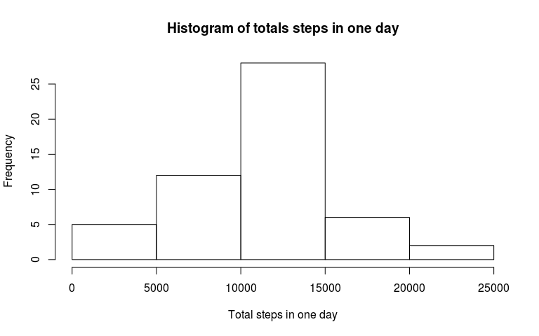
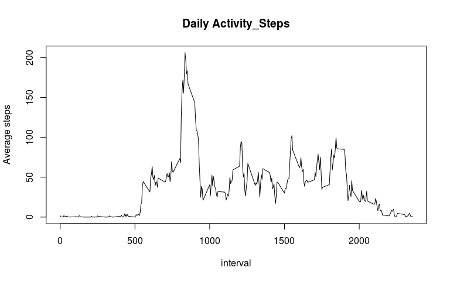
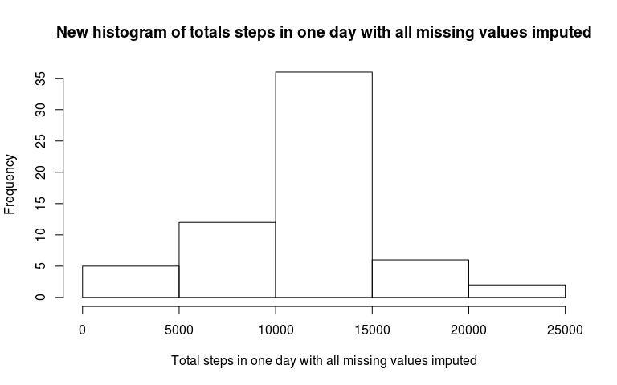

Week\#2\_Project\_Yefu
================
Yefu Wang
April 17th, 2017

R Markdown
----------

This is my report for project in week\#2 of "Reproducible Research".

The dataset "Activity monitoring data" contains the following variables: 1. steps: Number of steps taking in a 5-minute interval (missing values are coded as 𝙽𝙰) 2. date: The date on which the measurement was taken in YYYY-MM-DD format 3. interval: Identifier for the 5-minute interval in which measurement was taken

### 1. Reading data and quick view

First of all, let's take a quick view of the data.

``` r
summary(activity)
```

    ##      steps             date               interval     
    ##  Min.   :  0.00   Min.   :2012-10-01   Min.   :   0.0  
    ##  1st Qu.:  0.00   1st Qu.:2012-10-16   1st Qu.: 588.8  
    ##  Median :  0.00   Median :2012-10-31   Median :1177.5  
    ##  Mean   : 37.38   Mean   :2012-10-31   Mean   :1177.5  
    ##  3rd Qu.: 12.00   3rd Qu.:2012-11-15   3rd Qu.:1766.2  
    ##  Max.   :806.00   Max.   :2012-11-30   Max.   :2355.0  
    ##  NA's   :2304

As we see, there are quite a few NAs for steps, so let's remove them.

``` r
summary(activityFiltered)
```

    ##      steps             date               interval     
    ##  Min.   :  0.00   Min.   :2012-10-02   Min.   :   0.0  
    ##  1st Qu.:  0.00   1st Qu.:2012-10-16   1st Qu.: 588.8  
    ##  Median :  0.00   Median :2012-10-29   Median :1177.5  
    ##  Mean   : 37.38   Mean   :2012-10-30   Mean   :1177.5  
    ##  3rd Qu.: 12.00   3rd Qu.:2012-11-16   3rd Qu.:1766.2  
    ##  Max.   :806.00   Max.   :2012-11-29   Max.   :2355.0

### 2. Histogram of the total number of steps taken each day

Do the summation of all the steps in each individual day, and get the histogram as following:

``` r
stepsPerDay.sum <- tapply(activityFiltered$steps,activityFiltered$date,sum)
hist(stepsPerDay.sum,xlab = 'Total steps in one day', main = 'Histogram of totals steps in one day')
```



### 3. Mean and median number of steps taken each day

Based on the results above (stepsPerDay.sum), we could get the mean and median number of steps taken each day.

``` r
cat("The mean steps per day is:",mean(stepsPerDay.sum))
```

    ## The mean steps per day is: 10766.19

``` r
cat("The median steps per day is:", median(stepsPerDay.sum))
```

    ## The median steps per day is: 10765

### 4. Time series plot of the average number of steps taken

Do the similar calculations of average number of steps taken at different time intervals accross all the days. Then, plot the time series figure.

``` r
intervalList <- as.numeric(unique(activityFiltered[,"interval"]))
dailyActivity <- tapply(activityFiltered$steps,activityFiltered$interval,mean)
plot(intervalList,dailyActivity,type = "l",xlab = 'interval', ylab = 'Average steps', main = 'Daily Activity_Steps')
```



### 5. The 5-minute interval that, on average, contains the maximum number of steps

From the above daily activity figure, we can identify the 5-minute time interval which has the maximum number of average steps.

``` r
maximumStepsTime <- intervalList[dailyActivity == max(dailyActivity)]
maximumStepsTime
```

    ## [1] 835

### 6. Code to describe and show a strategy for imputing missing data

As we see in section 1, there are 2304 rows containing NAs. Actually, all the NAs are existing in the column of steps. In all above calculations, such missing value rows were removed. However, it might be worth imputing the missing value. The strategy selected here is to use the mean value of the same interval from all days to fill the NAs.

In order to achieve this, let's do it in the following algorithm: 1. Make a data frame (StepsByInterval.mean) that contains the mean steps on each day; 2. Make a new data frame called activityNew to store all the new results; 3. Loop the activity$steps, if it is NAs, then get its date and fill the NAs with the value obtained from the StepsByInterval.mean data frame.

``` r
StepsByInterval.mean <- data.frame(dailyActivity,intervalList)
activityNew <- activity
for (rowIndex in 1:dim(activityNew)[1]){
    if (is.na(activityNew[rowIndex,'steps'])){
        intervalIndex <- activityNew[rowIndex,'interval']
        missingValue <- StepsByInterval.mean[StepsByInterval.mean$intervalList == intervalIndex,'dailyActivity']
        activityNew[rowIndex,'steps'] <- missingValue
    }
}
```

### 7. Histogram of the total number of steps taken each day after missing values are imputed

So, let's take a look at the histogram of total number of steps taken each day with the new activity table.

``` r
stepsPerDay.sum.new <- tapply(activityNew$steps,activityNew$date,sum)
hist(stepsPerDay.sum.new,xlab = 'Total steps in one day with all missing values imputed', main = 'New histogram of totals steps in one day with all missing values imputed')
```



And, the new mean and media number of steps taken each day are calculated with the new activity table.

``` r
cat("The new mean steps per day is:",mean(stepsPerDay.sum.new))
```

    ## The new mean steps per day is: 10766.19

``` r
cat("The new median steps per day is:", median(stepsPerDay.sum.new))
```

    ## The new median steps per day is: 10766.19

Comparing to the results in section 2, it seems that the trend keeps similar. However, the total number of dates with valid values was 53; while the new number of dates with all NAs imputted is 61. So, there are more "dates" in the histogram in section 7.

Also, comparing to section 3, we can find that the mean value keeps the same 10766.19, and the median value changed a little. It is easy to explain, since we were using the mean value to fill the NAs.

### 8. Panel plot comparing the average number of steps taken per 5-minute interval across weekdays and weekends

First of all, let's do this with the activity table with all NAs removed (activityFiltered). Then, we need to make a label to indicate whether the date is a weekday(FALSE) or weekend(TRUE).

``` r
    library(chron)
    dayType <- is.weekend(activityFiltered$date)
    activityFiltered <- cbind(activityFiltered,dayType)
    weekdayActivity <- activityFiltered[!activityFiltered$dayType,]
    weekendActivity <- activityFiltered[activityFiltered$dayType,]
    WeekdaydailyActivity <- tapply(weekdayActivity$steps,weekdayActivity$interval,mean)
    WeekenddailyActivity <- tapply(weekendActivity$steps,weekendActivity$interval,mean)
    par(mfrow = c(1,2))
    plot(intervalList,WeekdaydailyActivity,type = "l",xlab = 'interval', ylab = 'Average steps', main = 'Weekday Daily Activity_Steps')
    plot(intervalList,WeekenddailyActivity,type = "l",xlab = 'interval', ylab = 'Average steps', main = 'Weekend Daily Activity_Steps')
```


Or we can use the newly modified activity.new table for the same plots.

``` r
    dayType <- is.weekend(activityNew$date)
    activityNew <- cbind(activityNew,dayType)
    weekdayActivity <- activityNew[!activityNew$dayType,]
    weekendActivity <- activityNew[activityNew$dayType,]
    WeekdaydailyActivity <- tapply(weekdayActivity$steps,weekdayActivity$interval,mean)
    WeekenddailyActivity <- tapply(weekendActivity$steps,weekendActivity$interval,mean)
    par(mfrow = c(1,2))
    plot(intervalList,WeekdaydailyActivity,type = "l",xlab = 'interval', ylab = 'Average steps', main = 'New Weekday Daily Activity_Steps')
    plot(intervalList,WeekenddailyActivity,type = "l",xlab = 'interval', ylab = 'Average steps', main = 'New Weekend Daily Activity_Steps')
```


As we can see, both plots (new and old activity table) are almost identical. It means that some missing values would not affect the researchers to make some conclusions.
